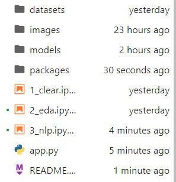
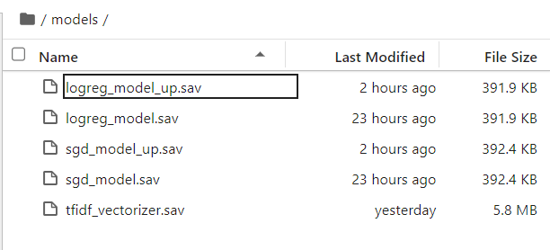
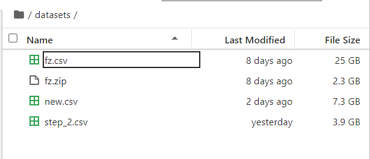
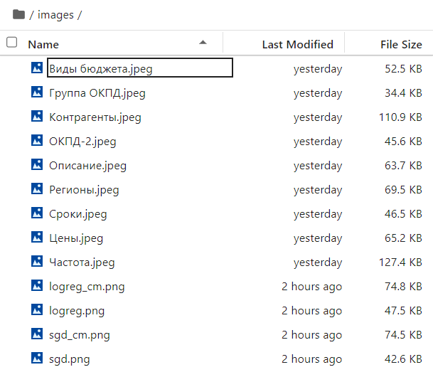

# Необходимо прочитать !!!

Сперва необходимо добавить файл подкачки в Windows. Сделать это желательно до 20 гб, чтобы все точно работало корректно, затем можно отключить

Запуск возможен файлами подряд, либо отдельно каждый, в случае, если у вас есть данные

# Перед запуском

Скопировать файл fz.csv в папку datasets
Файл датасета доступен по ссылке
```text
https://drive.google.com/file/d/1ug_s8iS5mQtZsHCnbtTtDNRyv38WBn5s/view?usp=sharing
```
Ввести команды, находясь в проекте:

```text
conda install pip
pip install -r requirements.txt
```

Либо просто ввести

```text
conda install pip
```

Тогда библиотеки установятся сами, если запускать и ознакамливаться с файлами подряд

# Структура проекта



Папка models после выполнения всех этапов



Папка datasets после выполнения этапов



Папка images после выполнения всех этапов



Если все корректно, вы также можете запустить приложение на streamlit. 

Для этого, находясь в папке с проектом, выполните команду:

```bash
streamlit run app.py

# Либо
python -m streamlit run app.py

# Либо
python3 -m streamlit run app.py
```

Если видите такую надпись, то все отлично:

```text
 You can now view your Streamlit app in your browser.
```

